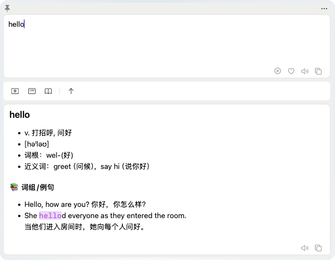

# Cactus AI Assistant

[简体中文](./README.md)

Cactus AI Assistant provides one-click translation, content summarization, word lookup, and screenshot OCR recognition to enhance your work and study efficiency.



---

### Key Features
- **Quick Translate**: Select text anywhere and press `⌥ + X` to get instant translations.
- **Smart Summarize**: Effortlessly condense long articles or documents into key points.
- **Contextual Dictionary**: Look up word definitions, etymology, and usage examples.
- **Screenshot OCR**: Capture any screen area to recognize and translate text instantly.
- **Vocabulary & Favorites**: Save important words and translated snippets for future review.
- **User-Friendly Permissions**: Improved accessibility request dialog that allows opening the main window even without full permissions.
- **Privacy First**: Your data stays on your machine, interacting only with the AI providers you configure.

### Installation

#### Homebrew (Recommended)
You can easily install Cactus via Homebrew:
```bash
brew install emlog/cactus
```

#### Manual Installation
1. Download the latest release from the [GitHub Releases](https://github.com/emlog/cactus/releases) page.
2. Drag `Cactus.app` to your `Applications` folder.

### Usage
- **Shortcut Keys**:
  - `⌥ + X`: Translate selected text.
  - `⌥ + S`: Summarize selected content.
  - `⌥ + Z`: Dictionary lookup.
  - `⌥ + A`: Screenshot OCR translation.
  - `⌥ + C`: Open the main assistant window.

### Configuration
Cactus supports various AI providers including OpenAI, DeepSeek, Claude, Gemini, and more. Simply provide your own API key in the Preferences.

### License
This project is licensed under the MIT License - see the [LICENSE](LICENSE) file for details.

## ❓ FAQ

### ⚠️ Warning: "Cactus is damaged and can't be opened. You should move it to the Trash."

Since the application has not yet been signed and notarized with an Apple Developer certificate, macOS's Gatekeeper mechanism may block this application and give a "damaged" or "move to Trash" warning.

**Solution:**
1. When the prompt appears, first click **"Cancel"** on the pop-up window.
2. Open macOS **"System Settings"** > **"Privacy & Security"**.
3. Scroll down to the "Security" section, where there will be an interception record (indicating "Cactus" has been blocked).
4. Click the **"Open Anyway"** (or **"Allow Anyway"**) button next to it, and enter your Mac login password or authorize via Touch ID in the pop-up security verification.
5. After authorization is completed, try to open **Cactus** again. An **"Open"** button will appear in the confirmation box. After clicking it, the system will remember your choice and you will not be blocked again.
